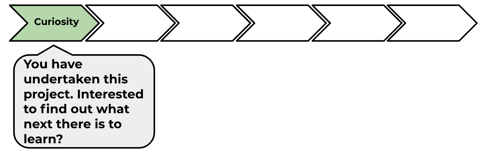

## What have you learned?

Now that you've built your first Scratch project, why not take a look at the 'Lost in space'. You can find it on the Scratch 1 module pathway.

--- no-print ---
Click on the green flag to see the animation.

  <iframe allowtransparency="true" width="485" height="402" src="https://scratch.mit.edu/projects/embed/276873231/?autostart=false" frameborder="0" scrolling="no"></iframe>
  

--- /no-print ---

--- print-only ---

--- /print-only ---

Click on the 'click me' button to try the next project

<a href="https://codeclub.org/en/scratch1">

